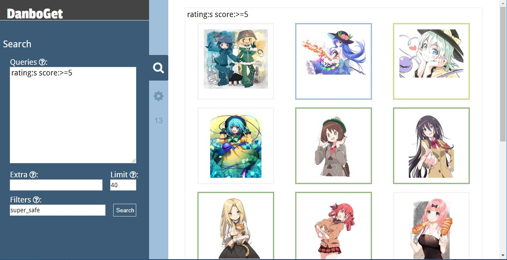
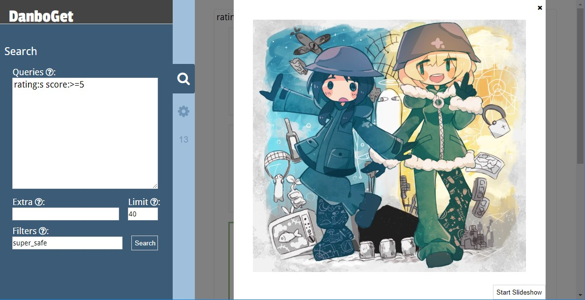

# DanboGet

An alternative frontend for Danbooru. It needs no database,
as configuration is stored in browser's localStorage.

### Instructions

Before you can run it, both in development or production mode, you need to
install the dependencies in the root folder and inside **app/** with
with `yarn install`.

The next step is to compile the SASS files into CSS, running `yarn build-css`
within the top folder. You also may run `yarn watch-css` so it builds all files
and also watches for changes.

Then you may run it in development mode running both `yarn start` and
`node app/app.js` at the top directory.

To run it in production you will need to build and assemble it with
`yarn build && yarn make-production` from the root of the project. And finally,
cd into **production/** and run it as a Node App with `yarn start-express`
or as an Electron App with `yarn start-electron`.
